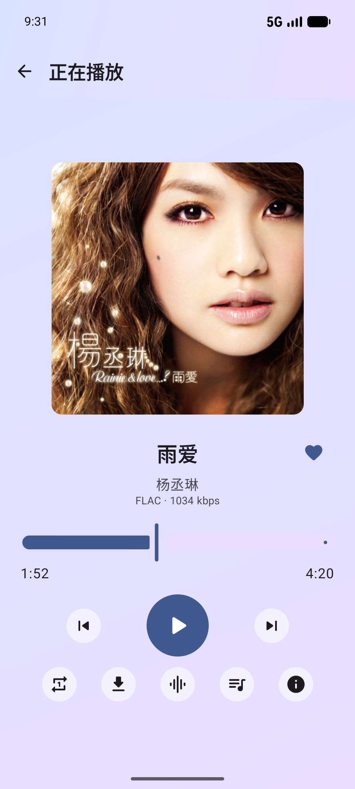

# ClearTune（轻调）

[English](README.en.md) | 简体中文

ClearTune 是一款面向 Navidrome / OpenSubsonic 的原生 Android 音乐客户端，专注于清晰、轻量且适合日常使用的私人音乐体验。应用直接连接用户自己的音乐服务器，不提供 ClearTune 云账户，也不会内置任何服务器地址或登录凭据。

当前版本：`1.0.0-rc1`

<p align="center">
  
</p>

## 功能

- 首页推荐：最近加入、换个口味、常听精选与发现音乐
- 音乐库：专辑、艺术家、歌曲与文件夹浏览、全库搜索及格式标识
- 歌曲与歌单：喜欢、下一首播放、添加到歌单、批量移除歌单歌曲及 Navidrome 双向同步
- 播放器：常驻迷你播放器、播放队列拖动排序、顺序/随机/循环模式、同步歌词与歌曲详情
- 离线能力：原始文件下载、暂停/继续、重复任务识别、Wi-Fi 等待提示、离线播放与缓存管理
- 音频体验：移动网络 128/192/320 kbps 或原始音质、均衡器预设、自定义调节与 ReplayGain 音量平衡
- 外观：Material 3、页面动效、专辑封面占位图、浅色/深色/跟随系统主题与沉浸式系统栏
- 更新：可选的 GitHub Releases 新版本检查

## 本次更新

- 扩充歌曲快捷操作，新增“下一首播放”、添加到歌单、下载、喜欢与详情入口。
- 播放队列改为长按拖动排序，并保留无障碍上移/下移操作；歌词视图与播放进度拖动也得到优化。
- 歌单支持多选并一次移除多首歌曲，专辑、艺术家和歌单详情页的加载状态更加稳定。
- 离线下载改用 OpenSubsonic 原始文件接口，增加续传校验、服务器错误提示、重复下载识别和 Wi-Fi 等待反馈。
- 移动网络新增原始音质选项，同时兼容 128、192 和 320 kbps 转码设置。
- 改进数字型音乐文件夹 ID、部分服务器不提供物理目录时的提示，以及艺术家同步和歌曲匹配的兼容性。

## 技术架构

- Kotlin、Jetpack Compose、Material 3
- Media3 / ExoPlayer 与 `MediaLibraryService`
- Retrofit、OkHttp、kotlinx.serialization
- Room、DataStore、WorkManager
- Hilt、Coroutines、Flow
- Navidrome / OpenSubsonic API

## 构建要求

- Android Studio 或命令行 Android SDK
- JDK 17
- Android SDK 37
- Windows、macOS 或 Linux

项目通过 Gradle Wrapper 固定构建工具版本。第三方依赖由 Gradle 在构建时从公开仓库下载，不存放在本仓库中。

## 构建

```bash
git clone https://github.com/itgou1/ClearTune.git
cd ClearTune
```

确保 `ANDROID_HOME` 指向 Android SDK，或在未纳入版本控制的 `local.properties` 中配置：

```properties
sdk.dir=/path/to/Android/Sdk
```

macOS / Linux：

```bash
./gradlew :app:assembleDebug
```

Windows：

```powershell
.\gradlew.bat :app:assembleDebug
```

APK 输出位置：`app/build/outputs/apk/debug/app-debug.apk`。

## 测试

运行本地单元测试：

```bash
./gradlew testDebugUnitTest
```

Windows 用户还可以启动可见的 Android 模拟器、构建、安装并打开应用：

```powershell
.\scripts\android-test.ps1
```

也可以直接双击 `start-android-test.bat`。脚本不会填写或保存音乐服务器的账号密码。

## 使用

1. 准备一个可访问的 Navidrome 或其他兼容 OpenSubsonic 的服务器。
2. 启动 ClearTune，输入服务器地址、用户名和密码。
3. 连接成功后，应用会从服务器读取音乐库、歌单和收藏状态。

凭据使用 Android Keystore 保护后保存在设备本地。ClearTune V1 不接入广告、统计 SDK 或大模型服务。

## 项目结构

```text
app/                 Android 应用与 Compose 界面
core/model/          领域模型与纯逻辑
core/network/        OpenSubsonic 网络协议
core/database/       Room 本地数据库
core/datastore/      设置与凭据存储
core/player/         Media3 播放、均衡器与音量平衡
core/designsystem/   主题与设计系统
scripts/             本地 Android 测试脚本
```

## 许可与商标

ClearTune 源代码采用 [GNU General Public License v3.0](LICENSE) 发布。发布本项目或其修改版本的 APK 时，必须按照 GPL-3.0 向接收者提供完整对应源码。

`ClearTune`、`轻调`、猫头鹰耳机图形和应用图标属于项目标识，不因 GPL-3.0 自动获得商标使用许可。修改版应使用不同的名称、图标和包名，并清晰说明其基于 ClearTune。详情参见 [商标政策](TRADEMARKS.zh-CN.md)。

## 相关项目

- [Navidrome](https://www.navidrome.org/)
- [OpenSubsonic API](https://opensubsonic.netlify.app/)
