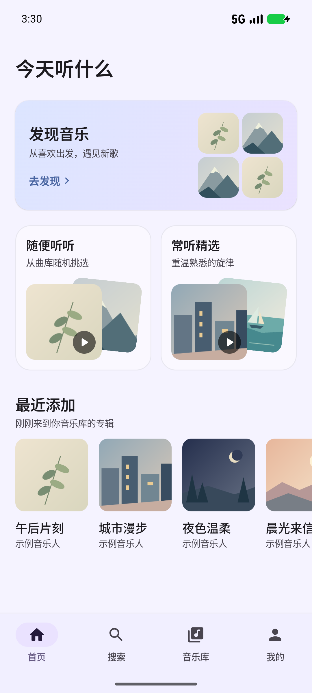
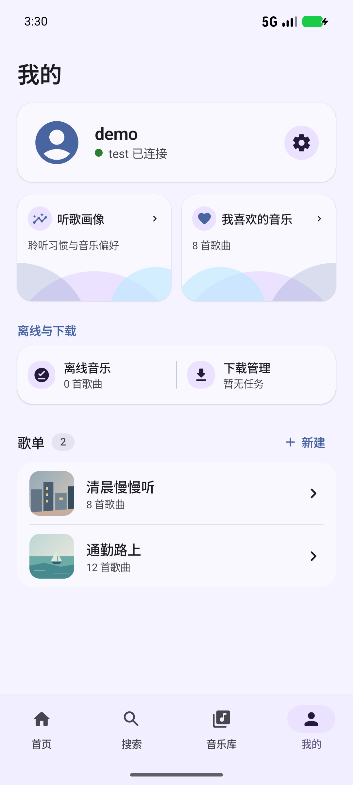

# ClearTune（轻调）

一款为私人音乐库设计的原生 Android 播放器。

ClearTune 连接你自己的 Navidrome 或 OpenSubsonic 兼容服务器，把浏览、播放、歌单、下载和音质设置整理成轻量、清晰的日常听歌体验。它不提供云音乐内容，也不要求注册 ClearTune 账号。

当前源码版本：`1.3.3` · [本次更新说明](release-notes/v1.3.3.md) · [已发布安装包](https://github.com/itgou1/ClearTune/releases)

## 真实界面

以下为 1.3.3 源码构建的 Debug 应用在 Android 模拟器中的直接截图，使用本地演示服务器、虚构曲目和原创插画封面，不连接真实用户账号，也不对截图中的控件或布局进行重绘。

<table>
  <tr>
    <td align="center"></td>
    <td align="center"></td>
  </tr>
  <tr>
    <td align="center"><sub>今天听什么</sub></td>
    <td align="center"><sub>我的音乐与歌单</sub></td>
  </tr>
</table>

截图展示浅色主题、未播放状态；内容会随曲库和播放记录变化。截图来源、重新生成方式及历史图片说明见 [界面图片说明](screenshots/README.md)。

## 产品亮点

### 打开就有想听的音乐

首页以“今天听什么”为标题，从上到下组织日常听歌入口：

- **发现音乐**：宽幅卡片配四张封面，点击进入发现页；曲库不足 20 首时不显示该区域
- **随便听听 / 好久不见、常听精选**：两张并排卡片，使用前后叠放的双封面，播放标识嵌入主封面；点击整张卡片即可播放，不必寻找单独的小按钮。左侧内容会根据播放记录切换，没有可用歌曲时卡片不可播放
- **最近添加**：横向浏览新加入音乐库的专辑，点击封面进入专辑

首次进入时内容轻量渐入，卡片按压时有缩放反馈；返回首页不重复播放入场动画。推荐只来自你自己的曲库，不混入广告或平台推广内容。

### 喜欢、画像与歌单集中在“我的”

- 听歌画像与“我喜欢的音乐”并排展示，便于快速进入
- 歌单直接列在当前页面，数量显示在“歌单”标题旁，不再设置重复的歌单汇总快捷入口
- 离线与下载使用紧凑入口，减少页面占用；设置入口保留在页面右上角
- “我喜欢的音乐”记住上次排序方式，歌曲使用 ♪ 占位符，不展示无意义的曲目编号

### 从曲库到播放，操作更顺手

- 按专辑、艺术家、歌曲、流派或服务器文件夹浏览；流派可直接进入对应歌曲列表
- 搜索会先从本地缓存即时显示结果，再合并服务器结果，并支持继续加载更多内容
- 音乐库显示当前同步阶段和上次成功同步时间，连接异常时仍保留本地内容
- 快速喜欢歌曲、下一首播放、加入歌单、下载或查看歌曲详情
- 歌单与 Navidrome 同步，支持搜索选歌、按喜欢或最近播放筛选，以及批量添加和移除歌曲
- 常驻迷你播放器，在浏览不同页面时也能继续控制播放
- 播放队列支持长按拖动排序，并提供顺序、随机和循环模式
- 支持同步歌词、歌曲格式与码率信息，以及播放进度快速调整

### 离线也能完整听歌

ClearTune 可以下载服务器中的原始音乐文件，并支持暂停、继续和断点续传。下载列表与后台任务同步，显示实际进度，以及等待网络、等待调度、自动重试或失败原因；服务器拒绝下载、返回非音频内容、本地空间不足时会给出明确提示。

“仅使用 Wi-Fi 下载”按非计费网络判断：被系统标记为计费的 Wi-Fi 也会等待。修改网络限制后，对已有未完成任务生效。取消下载任务与删除已完成文件使用不同操作文案，并在删除前再次确认；下载完成后可直接使用本地文件播放。

播放缓存与主动下载分开管理：缓存上限可选 **512 MB、1 GB、2 GB、4 GB**，默认 512 MB，达到上限后淘汰旧缓存；主动下载的离线歌曲不属于这项播放缓存额度。

### 音质由你决定

- Wi-Fi 下默认保留服务器提供的原始音质
- 移动网络可选择 128、192、320 kbps，或继续使用原始音质
- ReplayGain 音量平衡，减少不同专辑之间忽大忽小的听感
- 提供易用的均衡器预设，也支持自定义调节

### 贴近日常 Android 使用习惯

界面采用 Material 3，支持浅色、深色和跟随系统主题，并配有沉浸式系统栏、自然的页面动效和无封面时的统一占位图。播放、下载和操作结果会在当前页面及时反馈。

## 为私人音乐库而设计

<p align="center">
  
</p>
<p align="center"><sub>隐私关系示意图；不展示账号、服务器地址、真实封面或曲目信息。</sub></p>

- 应用只连接你主动配置的音乐服务器，不内置公共服务器或共享账号
- 不提供 ClearTune 云账户，曲库和播放内容不会上传到 ClearTune 服务
- 登录凭据由 Android Keystore 保护并保存在设备本地
- 音乐库、下载、队列和搜索历史等本地数据按服务器与账号隔离；退出账号时停止播放、清空当前队列并取消后台下载
- 喜欢、歌单和播放记录只在本地设备与你的音乐服务器之间处理或同步
- 不接入广告、用户行为统计 SDK 或大模型服务
- 开启更新检查时，仅访问公开的 GitHub Releases 接口

## 适合谁

ClearTune 适合已经拥有 Navidrome 或其他 OpenSubsonic 兼容服务器，希望在 Android 上获得原生、轻量、重视离线和音质体验的用户。

它不是在线音乐平台，不提供歌曲版权内容或公共曲库；使用前需要准备一个可访问的私人音乐服务器。目前客户端面向 Android 设备。

## 快速开始

1. 从项目的 [GitHub Releases](https://github.com/itgou1/ClearTune/releases) 下载并安装最新版 APK。
2. 准备一个可访问的 Navidrome 或 OpenSubsonic 兼容服务器。
3. 打开 ClearTune，填写服务器地址、用户名和密码。
4. 连接成功后，即可浏览曲库、同步喜欢与歌单并开始播放。

### 从旧版本升级至 1.3.3

本版启用账号隔离。旧版无法确认归属的本地数据不会自动读取或迁移，也不会主动删除。请在升级前联网完成尚未同步的修改；升级后重新同步音乐库，并重新下载需要离线收听的歌曲。服务器上的音乐、收藏与歌单不受影响，旧本地队列、播放记录和搜索历史不会自动迁移。

正式版使用原有签名，可覆盖安装，无需卸载。Debug 版可能因签名不同无法覆盖，请勿为升级贸然卸载。

<details>
<summary>开发者构建信息</summary>

本项目使用 JDK 17 和 Android SDK 37，并通过 Gradle Wrapper 固定构建工具版本。

```bash
git clone https://github.com/itgou1/ClearTune.git
cd ClearTune
```

macOS / Linux：

```bash
./gradlew :app:assembleDebug
```

Windows：

```powershell
.\gradlew.bat :app:assembleDebug
```

运行本地单元测试：

```bash
./gradlew testDebugUnitTest
```

Debug APK 输出到 `app/build/outputs/apk/debug/app-debug.apk`。正式版由仓库的 GitHub Actions 工作流签名并发布到 GitHub Releases；签名文件和密码不得提交到仓库。

</details>

## 许可与商标

ClearTune 源代码采用 [GNU General Public License v3.0](LICENSE) 发布。发布本项目或其修改版本的 APK 时，必须按照 GPL-3.0 向接收者提供完整对应源码。

`ClearTune`、`轻调`、猫头鹰耳机图形和应用图标属于项目标识，不因 GPL-3.0 自动获得商标使用许可。修改版应使用不同的名称、图标和包名，并清晰说明其基于 ClearTune。详情参见 [商标政策](TRADEMARKS.zh-CN.md)。

## 相关生态

- [Navidrome](https://www.navidrome.org/)
- [OpenSubsonic API](https://opensubsonic.netlify.app/)
